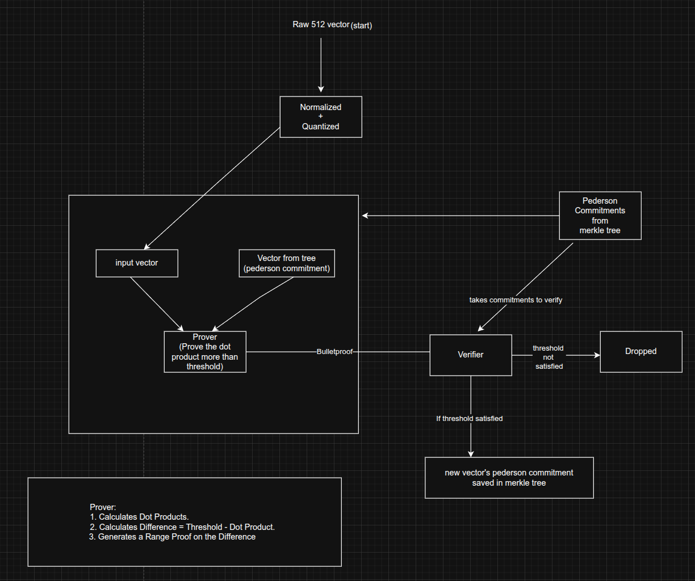
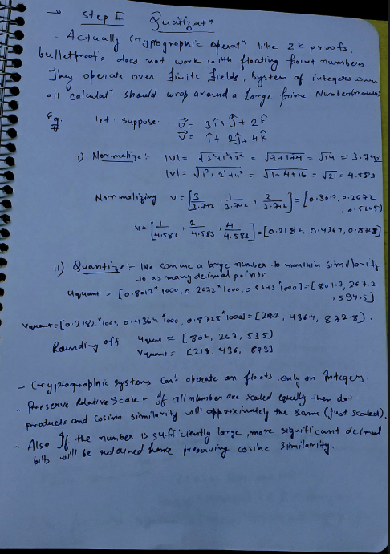

## Architecture: Zk Mask
---

The most **ROBUST , SECURE, EFFICIENT and OPTIMIZED** solution for Zk Mask
### 1. Overview & Core Objective

This document outlines the architecture for high-security biometric system. The primary goal is to verify a new user's biometric uniqueness against an entire existing user database without ever revealing the underlying biometric data of any user.

The chosen method is a **full database scan** made efficient through **parallel processing** and a single, **aggregate Zero-Knowledge Proof** using the **Bulletproofs** protocol. This approach provides the highest level of security by offering a deterministic guarantee of uniqueness.


---

### 2. The Choice of Storage: Merkle Tree over SQL or IPFS

Before detailing the flow, it's crucial to understand our choice of data structure for storing user commitments. We will store all user Pedersen Commitments as leaves in a **Merkle Tree**.

#### Why a Merkle Tree?

A Merkle tree provides a single, cryptographic fingerprint (the **Merkle Root**) for our entire user database. This is superior to other options for several key reasons. Using a Merkle tree gives us fast access, cryptographic integrity, and auditability — all in one structure. Here's why it's the right fit:

- **Tamper-proof integrity:** Any change in even a single user commitment changes the Merkle root. This acts like a cryptographic fingerprint for the entire dataset, making unauthorized edits immediately detectable.

- **Verifiable state:** The Merkle root can be published periodically (e.g., on-chain) to prove the state of the database at specific points in time. This allows for public audits without exposing user data.

- **Efficient batch proofing:** We can retrieve all `N` commitments for a zero-knowledge proof in a low-latency way, without needing to scan or rehash unrelated data.

- **Faster than SQL for our case:** While SQL databases are fast for typical queries, they don't offer native support for cryptographic state verification. Merkle trees give us both.

- **More reliable than IPFS:** IPFS is great for static public files, but its peer-to-peer nature introduces unpredictable latency and doesn't suit dynamic, private datasets like ours.

> Summary: Merkle trees give us fast lookups, state commitment, and cryptographic integrity — all essential for secure, high-performance ZK verification systems.

### Also Why Pedersen Commitments instead of Poseidon 

- **Additive Homomorphism:** Pedersen commitments support secure **dot product computations** via homomorphic properties — which is essential for cosine similarity checks. In contrast, Poseidon (being hash-based) does **not** support homomorphic operations.

  Given two values `a` and `b` with randomness `r₁` and `r₂`, their Pedersen commitments are:

  - In multiplicative notation:
    ```
    C₁ = g^a · h^r₁  
    C₂ = g^b · h^r₂  

    C₁ · C₂ = (g^a · h^r₁) · (g^b · h^r₂)  
            = g^(a + b) · h^(r₁ + r₂)
    ```

  - In additive (elliptic curve) notation:
    ```
    C₁ = a·G + r₁·H  
    C₂ = b·G + r₂·H  
    C₁ + C₂ = (a + b)·G + (r₁ + r₂)·H
    ```

- **Efficient with Bulletproofs:** Pedersen commitments are natively supported in Bulletproofs, allowing for compact, non-interactive ZK range and inner product proofs — without needing additional hash constraints or custom gadgets.

Also here it explained theoritically


> ✅ **Summary:** Pedersen commitments provide the arithmetic flexibility, proof efficiency, and mathematical guarantees we need — which Poseidon can't offer in this use case.


---

### 3. End-to-End System Flow: Similarity Verification Method

This flow details the complete lifecycle of a new user registration.




#### Step 1: Biometric Preprocessing (Client-Side)

The process begins when a new user provides their biometric data. This data is handled in a secure environment.

1.  **Feature Extraction:** The raw biometric input is converted into a **512-dimensional raw vector (`u_raw`)**.
2.  **Normalization:** The vector's magnitude is calculated (`||u_raw||`), and each component is divided by it. This creates a **unit vector (`û`)** where `||û|| = 1`.
    *   **Reason:** This crucial step simplifies the complex `cosine similarity` calculation into a simple `dot product`, which is far more efficient for ZK circuits.

    
3.  **Quantization:** The floating-point numbers in `û` are converted into large integers (`u_quant`) by multiplying them by a large scaling factor (e.g., `10^6`).
    *   **Reason:** Cryptographic circuits operate on integers in a finite field, not floating-point numbers.
    

#### Step 2: Proof Generation (The Prover's Task)

This is the most computationally intensive phase. The **Prover** module executes the following:

1.  **Data Retrieval:** The Prover fetches all `N` existing user Pedersen Commitments (`C_v1, C_v2, ...`) and the current Merkle Root from the server's database.
2.  **Circuit Construction:** The Prover builds a large, parallel **arithmetic circuit** in memory. This circuit is a mathematical representation of the entire verification logic.
3.  **Core Logic within the Circuit:** For *each* of the `N` commitments, the circuit is designed to enforce the following rules:
    *   **Inner Product Calculation:** It calculates the dot product `d_i = u_quant · v_i`, where `v_i` is the secret vector hidden inside the commitment `C_vi`.
    *   **Threshold Comparison:** It enforces the core business logic. Based on our latest discussion, the goal is to prove **high similarity**. The logic is `d_i >= Threshold`.
    *   **Range Proof Transformation:** This inequality is converted into a format the circuit can handle: `diff_i = d_i - Threshold >= 0`. The circuit will prove that `diff_i` is a positive number.
4.  **Proof Generation:** The Prover runs the **Bulletproofs algorithm** on this entire aggregated circuit. The output is a single, compact proof object (`π`).
    *   **Reason:** The proof `π` acts as a cryptographic guarantee that a secret vector `u_quant` exists that satisfies all `N` similarity checks simultaneously, without revealing the vector itself.

#### Step 3: Verification (The Verifier's Task)

The compact proof `π` is sent to the server for verification.

1.  **Inputs:** The **Verifier** module takes three public inputs:
    *   The proof object `π`.
    *   The list of all `N` public commitments (`C_v1, C_v2, ...`) it provided earlier.
    *   The public threshold value.
2.  **Verification Algorithm:** The Verifier runs the Bulletproofs `verify()` function.
    *   **Reason:** This function is extremely fast. It checks the mathematical consistency of the proof against the public commitments without needing any secret data. Its runtime is logarithmic, meaning it scales very well even with thousands of commitments.
3.  **Decision:**
    *   If the function returns **TRUE**, the proof is valid. The new user's vector has met the similarity threshold.
    *   If it returns **FALSE**, the proof is invalid. The user is rejected.

#### Step 4: System State Update (If Verification Succeeds)

If the proof is valid, the system's state must be updated.

1.  **Create New Commitment:** A new Pedersen Commitment (`C_new`) is created for the user's vector `u_quant`.
2.  **Insert into Merkle Tree:** `C_new` is added as a new leaf to the Merkle tree.
3.  **Recalculate Root:** The hashes up the tree are recalculated, resulting in a **new Merkle Root**.
4.  **Commit to Database:** The new commitment and the updated Merkle Root are saved, finalizing the transaction. The system is now ready for the next user.

This end-to-end process ensures that every user is verified against the entire database with the highest level of privacy and data integrity.

```rust
// --- High-Level Pseudocode ---

// Public parameters available to both prover and verifier
struct PublicParameters {
    generators: GeneratorPoints, // Elliptic curve points (G, H)
    db_commitments: Vec<VectorCommitment>, // The N commitments from the Merkle Tree
    threshold: Scalar, // The 0.1 threshold 
}

// The secret data only the prover knows
struct ProverSecrets {
    new_vector: Vec<Scalar>, // raw 512-dimensional new vector 
    blinding_factors: Vec<Scalar>, // Random scalars used in the commitments
}

// The final, compact proof object
struct AggregateSimilarityProof {
    // internal Bulletproofs data (commitments, scalars, etc.) 
    // typically < 1KB
}

fn generate_aggregate_similarity_proof(
    params: &PublicParameters,
    secrets: &ProverSecrets,
) -> AggregateSimilarityProof {

    // 1. Initialize a 'Prover' 
    let mut prover = Prover::new(&params.generators, "similarity_proof");

    // 2. Define the circuit constraints
    build_aggregate_circuit(&mut prover, &params, &secrets);

    // 3. Generate the final proof based on all the constraints added.
    let proof = prover.prove();

    return proof;
}

// proof verifier
fn verify_aggregate_similarity_proof(
    params: &PublicParameters,
    proof: &AggregateSimilarityProof,
) -> bool {

    // 1. Initialize a 'Verifier' from a Bulletproofs library transcript
    let mut verifier = Verifier::new("similarity_proof");

    // 2. Re-define the *same* circuit structure (without the secret values)
    build_aggregate_circuit_verification(&mut verifier, &params);

    // 3. The verifier uses the proof to check if the circuit constraints
    // hold true without needing the secret vector.
    return verifier.verify(&proof);
}

fn build_aggregate_circuit(
    prover: &mut Prover,
    params: &PublicParameters,
    secrets: &ProverSecrets,
) {
    // Commit to the secret vector 'u', can be used for reference
    let (u_commitment, u_vars) = prover.commit_vector(&secrets.new_vector);

    // for all commitments in db
    for (i, v_commitment) in params.db_commitments.iter().enumerate() {

        // --- Step A: Inner Product Constraint ---
        // This constraint proves that a variable `dot_product_i` is indeed the
        // inner product of our secret vector 'u' and the i-th database vector 'v_i'.
        // The verifier knows 'v_commitment', and the prover supplies 'u_vars' (u's values).
        let dot_product_i = prover.inner_product(
            &u_vars, // Secret variables for vector u
            v_commitment, // Public commitment to vector v_i
        );

        // --- Step B: Range Proof Constraint ---
        // Prove that `0.1 - dot_product_i > 0`.
        let diff_i = prover.constrain_difference(params.threshold, dot_product_i);

        // Now, add a range proof constraint to prove that `diff_i` is in the range [0, 2^64-1].
        // This cryptographically proves it's a positive number.
        prover.range_proof(diff_i, 64);
    }
}


```

### 4. Why Bulletproofs for ZK Proofs

- **No Trusted Setup (vs. zk-SNARKs):** Unlike zk-SNARKs, which require a special setup phase that generates sensitive secret parameters, Bulletproofs need no such ceremony. This removes the risk of hidden trapdoors or long-term trust assumptions.

- **Compact Proofs (vs. zk-STARKs):** STARKs are post-quantum secure but come with large proof sizes (often 10–100× bigger). Bulletproofs are compact (typically <1 KB), ideal for fast, low-bandwidth authentication.

- **Ideal for Range & Batch Proofs:** Since our system performs **cosine similarity checks over a batch of 10,000 encrypted vectors**, Bulletproofs are particularly well-suited due to their efficiency in **range proofs and batched inner product verifications**.

> **Summary:** Bulletproofs offer strong security, no trusted setup, efficient range proofs, and compact size — making them the optimal ZK protocol for our biometric similarity system.


### 5. System Considerations: Risks, Guarantees, and Limitations

While the proposed architecture offers robust privacy, it's essential to understand its trade-offs in a real-world context.

#### Privacy Guarantees
The system provides strong mathematical assurances about user privacy:
*   **Data Minimization:** Raw biometric vectors are never stored. Only cryptographic commitments, which are irreversible, are persisted in the database .
*   **Zero-Knowledge Authentication:** The verification process confirms a user's identity without revealing any underlying biometric data to the verifier or any eavesdropper . The only information learned is the binary outcome of the proof (valid or invalid).
*   **Unlinkability (with proper design):** The use of random blinding factors in Pedersen commitments ensures that commitments for the same user in different systems (or even different sessions) are not cryptographically linkable.

#### Potential Risks & Limitations
No system is without risks. The primary considerations are:
*   **Computational Overhead:** Generating ZK proofs is computationally intensive, potentially impacting user experience during login. This is a trade-off for the enhanced privacy.
*   **High Setup Cost:** Comparing a new vector with thousands of other vectors can be slow as we are using the batch processing instead of one by one it gives us performance boost but might require expensive hardware to run smoothly.


#### Performance and Scalability
The system is designed to be performant and scalable, but with specific implications:
*   **Proof Generation:** This is the slowest part of the process and happens on the client side. Performance depends on the client's hardware. Techniques like precomputation can help reduce this time .
*   **Proof Size:** Bulletproofs generate very compact proofs (typically under 1KB), which minimizes network bandwidth requirements—a significant advantage over zk-STARKs .
*   **Verification Time:** Verification is extremely fast and scales logarithmically, not linearly. Using **batch verification**, the server can verify hundreds of proofs simultaneously with minimal additional cost, enabling high throughput and scalability. This makes the server-side operations highly efficient.


