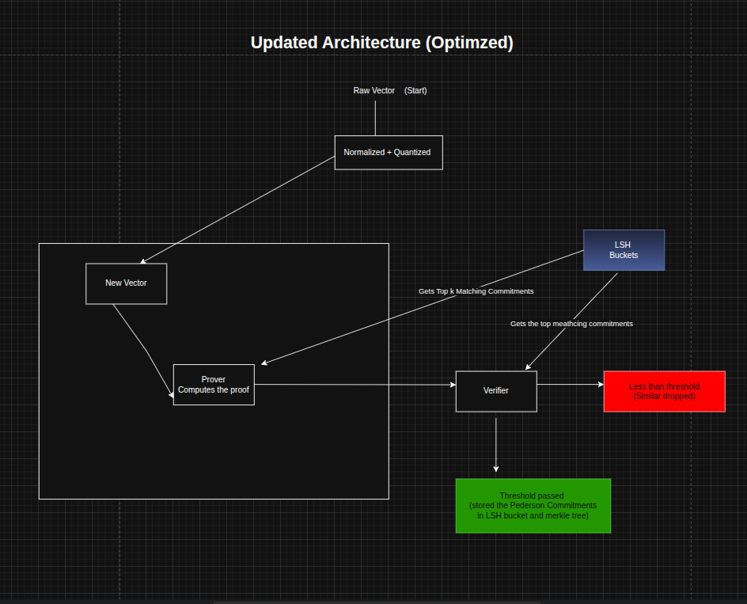

# Architecture Zk Mask: LSH-Optimized Approach

---

### 1. The Optimization Need

Our initial "full scan" architecture provides the highest level of security but requires significant computational resources to generate a single proof against thousands of entries. For systems where performance or cost is a primary constraint, we can introduce an optimization layer using **Locality-Sensitive Hashing (LSH)**.

The goal of this approach is to drastically reduce the number of comparisons needed, making the ZK proof generation significantly faster and less resource-intensive.

### 2. The LSH-Based Approach

This method replaces the full database scan with a targeted, probabilistic search.

1.  **Data Structure:** We maintain a key-value store where the **key is an LSH bucket ID** and the **value is a list of Pedersen commitments** that hash to that bucket.
2.  **New Vector Arrives:** When a new vector `u` is submitted, we first compute its LSH bucket ID.
3.  **Candidate Selection:** We retrieve only the `k` commitments stored in that specific bucket. These are our "most probable" matches.
4.  **Targeted ZK Proof:** We generate a much smaller and faster ZK proof with the statement:
    > "The new vector `u` has a cosine similarity **greater than 10%** with at least one of the `k` candidate vectors from this bucket."
5.  **State Update:** If the proof is valid, the new user is authenticated. If this were an enrollment system, we would insert the new vector's commitment into the same LSH bucket.

---

### 3. What is Locality-Sensitive Hashing (LSH)?

LSH is a hashing technique designed to ensure that similar items are likely to end up in the same "bucket." For cosine similarity, the most common method is **Random Hyperplane LSH**.

#### How it Works:

1.  **Setup:** The system generates a set of `M` random hyperplanes (which are just random vectors of the same dimension, e.g., 512).
2.  **Hashing a Vector:** To get the LSH hash (the bucket ID) for any given vector `v`, we compute the dot product of `v` with each of the `M` random hyperplanes.
    *   If `dot(v, H_i)` is positive, the i-th bit of the hash is `1`.
    *   If `dot(v, H_i)` is negative, the i-th bit of the hash is `0`.
3.  **Result:** This process produces an `M`-bit binary string, which serves as the bucket ID. Similar vectors will lie on the same side of most hyperplanes and will thus have identical or very similar bucket IDs.

#### Mathematical Example:

Let's assume we have a 4D vector `V` and 3 random hyperplanes `H1, H2, H3`.

*   **Vector:** `V = [0.6, -0.1, 0.4, 0.5]`
*   **Hyperplanes:**
    *   `H1 = [0.2, -0.4, 0.6, 0.1]`
    *   `H2 = [-0.5, 0.7, -0.3, 0.4]`
    *   `H3 = [0.1, 0.3, 0.9, -0.2]`

*   **Dot Product Calculation:**
    *   `dot(V, H1)` = 0.45  (Positive) -> **Bit 1 = `1`**
    *   `dot(V, H2)` = -0.29 (Negative) -> **Bit 2 = `0`**
    *   `dot(V, H3)` = 0.29  (Positive) -> **Bit 3 = `1`**

*   **Final Bucket ID:** The resulting LSH hash for vector `V` is **`"101"`**. Its Pedersen commitment would be stored in the bucket associated with this ID.

#### Storage Structure:

The database would be a simple map from the bucket ID to a list of commitments.

```
{
"101": ["Commitment_A", "Commitment_F", "Commitment_X"],
"011": ["Commitment_B", "Commitment_G"],
"110": ["Commitment_C"]
}
```


---

### 4. Updated Architecture Diagram




---

### 5. Pros & Cons of the LSH Approach

This optimization introduces a significant trade-off between performance and security guarantees.

#### Pros:

*   **Massive Performance Gain:** Instead of generating a proof against 10,000+ vectors, the prover only needs to work with a handful of candidates (`k`). This dramatically reduces the computational load and makes proof generation much faster.
*   **Lower Resource Cost:** The reduced computational requirement means the system can run effectively on less expensive hardware.
*   **Scalability:** The search time for candidates remains low even as the total number of users grows, as long as the buckets remain reasonably balanced.

#### Cons:

*   **Probabilistic, Not Deterministic:** LSH is probabilistic, meaning there is a very small but non-zero chance that two similar vectors will hash to different buckets. This can lead to a **false negative**, where a matching user is not found. This can further be reduced using multiple LSH, ie. checking up to k buckets instead of once and then store the commitment in k buckets.
*   **Tuning Complexity:** The system requires careful tuning of the number of hyperplanes and hashing tables to balance the trade-off between accuracy (avoiding false negatives) and performance (keeping buckets small).

> **Summary:** The LSH approach offers a significant performance boost at the cost of introducing a probabilistic element into a security-critical system. It is an excellent option for applications where speed is paramount and a small statistical risk of error is acceptable.
